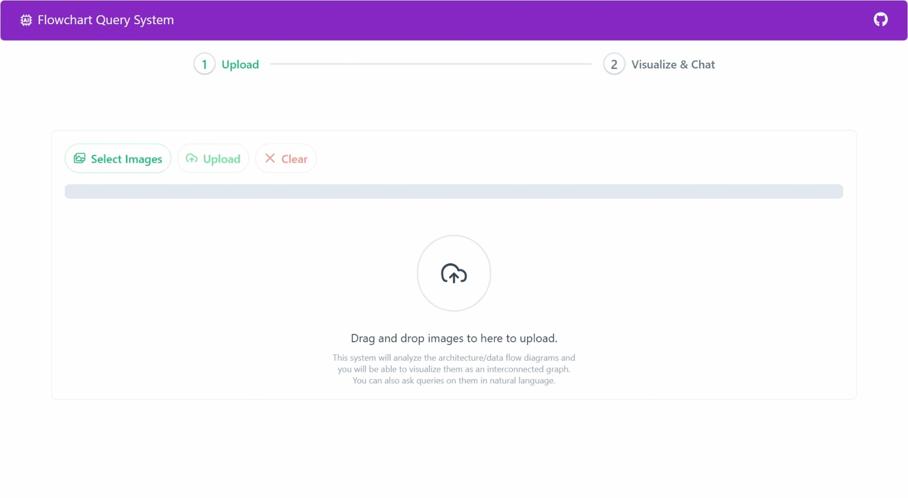

# AI-Powered Flowchart Query System : Upload Images, Visualize as Interconnected Graph, & Ask Questions

## Business Context

Modern businesses rely on visual data for clear communication and quick decision-making. Extracting meaningful information from images or diagrams can be time-consuming. This system automates the extraction, making visual data accessible through natural language queries.

## Overview

The AI-Powered Flowchart Query System processes interconnected architecture/data flow diagrams to build relationships between modules, systems, or applications. Users can then query data flows and dependencies in natural language. The system identifies what is connected, what data is flowing, and the direction of the flow. Users can also visualize them as an interconnected graph.

## Key Features

- **Image Upload**: Upload multiple images of interconnected architecture/data flow diagrams. The system processes the images to identify modules, systems, or applications and their relationships.
- **Graph Visualization**: Visualize the architecture/data flow diagrams with nodes and edges representing modules, systems, or applications and their relationships.
- **Natural Language Query**: Query the system using natural language to retrieve information about data flows and dependencies.
- **Relevant Subgraph Processing**: Identify only the necessary segments from the architecture/data flow diagrams based on the query, reducing extraneous context and enhancing result accuracy.
- **Relevant Subgraph Visualization**: Visualize the relevant subgraph of the architecture/data flow diagrams based on the query, focusing on the queried modules, systems, or applications and their relationships.
- **New Image Upload**: More images can be uploaded to add to the existing architecture/data flow diagrams, updating the relationships and visualizations.
- **Merging of Similar Nodes and Edges**: The system identifies similar nodes and edges across different diagrams and merges them to reduce redundancy and improve visualization clarity.
- **Sources used for Query**: The system provides the sources (image names) of information used to answer the query, enabling users to verify the accuracy and relevance of the results.
- **Persistent Chat Context for Queries**: The system maintains a chat context for each user session, allowing users to ask follow-up questions or refine their queries without repeating the context.
- **Feedback Mechanism**: Users can visually edit the graph completely to correct any inaccuracies or provide feedback on the system's performance.

## Screenshots and User Flow

### Input Data Flow Diagrams

Lets consider the following 3 input data flow diagrams:

1. **Diagram 1**:
   ```mermaid
   graph LR
    A[Frontend] -->|Submit Form| B[API Gateway]
    B -->|Validate Request| C[Auth Service]
    C -->|Token Valid| D[Data Service]
    C -->|Invalid| A
    D -->|Query Data| E[Database]
    E -->|Return Results| D
    D -->|Format Response| A
    B -->|Cache Check| F[Redis Cache]
    F -->|Cache Hit| A
   ```
2. **Diagram 2**:
   ```mermaid
   graph LR
   G[Mobile App] -->|API Call| B[API Gateway]
   B -->|Route Request| H[Payment Service]
   H -->|Process Payment| I[Payment Gateway]
   I -->|Success| H
   I -->|Failure| G
   H -->|Update| E[DataBase]
   H -->|Notify| J[Notification Service]
   J -->|Push Alert| G
   ```
3. **Diagram 3**:
   ```mermaid
   graph LR
    K[Admin Portal] -->|Configure| L[Config Service]
    L -->|Update Settings| E[Database]
    L -->|Broadcast| M[Message Bus]
    M -->|Notify| B[API-GateWay]
    M -->|Refresh| F[Redis-cache]
    M -->|Alert| N[Monitoring]
    N -->|Status| K
   ```

**Shared Nodes:**

- `API Gateway`/`API-GateWay` appears in first and second diagrams
- `Database`/`DataBase` appears in all three diagrams
- `Redis Cache`/`Redis-cache` appears in first and third diagrams

> Note: The spellings are different in the diagrams, but the system will intelligently identify that these are the same entities.

### Uploading Images in the System

To upload the flow diagrams, click on the "Select Images" button and select multiple images from your local system. Then click on the "Upload" button to upload the images. After they are uploaded, the system will show a toast message indicating the successful upload.



> Note: User can upload more images at a later stage also by simply clicking on the "Upload" tab.

### Visualizing the Graph

After uploading the images, the system processes the images to identify the nodes and edges. The system then merges similar nodes and edges across different diagrams to reduce redundancy and improve visualization clarity. The user can visualize the graph by clicking on the "Visualize & Chat" tab.

> Note: The nodes will have seperate colors based on the diagram they were extracted from.


You can see that the system has identified the nodes and edges from the uploaded images and merged similar nodes and edges across different diagrams. The shared nodes with different spellings are intelligently merged into a single node.

### Human Feedback Mechanism

If the user finds any inaccuracies in the graph, they can edit the graph by adding, removing, or updating nodes and edges. Click on the "Edit" button to start editing the graph.

#### Adding a Node


#### Adding a Edge


#### Updating a Node


#### Updating an Edge


#### Removing a Node


#### Removing an Edge


### Asking Questions

After visualizing the graph, the user can ask questions about the data flows and dependencies in natural language. The system processes the query and identifies the relevant subgraph based on the query. The user can see the relevant subgraph and the response to the query as well as the sources (image names) used to answer the query.

#### Query: "How does the Frontend communicate with the Database?"

The query aims to explore the interactions and data flow between the Frontend and Database in the system's architecture.


> Note: The system lists only the Frontend Flow image as the source for the query as it contains the relevant information.

#### Query: "What are the different calls coming to the Database?"

The query seeks to identify the various calls made to the Database in the system's architecture.


Note: The system lists all three images as the sources for the query as they contain the relevant information. Also toggling off the "Show Relevant Segments" checkbox will show the full graph.

## Data Flow Diagrams

### Image Upload


### Query System


### Feedback Mechanism


## Development

### Running Database (Neo4j)

This project uses Neo4j as the database. To run the database locally, execute the following command:

```sh
neo4j-admin server console
```

In case you have a hosted Neo4j instance, you can update the connection details in the `Backend/.env` file.

### Running Backend (Python)

#### Installing Dependencies

The backend is written in Python. Before running the backend, make sure to install the dependencies:

```sh
cd Backend
# create virtual environment
python -m venv .venv
# activate virtual environment
source .venv/Scripts/activate
# or for linux/ mac os
# source .venv/bin/activate
# install dependencies
pip install -r requirements.txt
```

#### Setting Environment Variables

Create a `.env` file in the `Backend` folder by copying the `.env.template` file and updating the values as required. Make sure to include necessary configurations such as database connection strings and API keys.

```sh
cp .env.template .env
```

Populate the `.env` file with the required values.

#### Starting the Backend

Now to run the backend, execute the following command:

```sh
# Inside Backend folder
uvicorn main:app --reload
# or
# python main.py
```

### Running Frontend (Angular)

#### Installing Dependencies

The frontend is written in Angular. So make sure to install NodeJS and Angular CLI before running the frontend:

First install the dependencies:

```sh
cd Frontend
npm install
```

#### Starting the Frontend

Now to run the frontend, execute the following command:

```sh
# Inside Frontend folder
npm start
```
